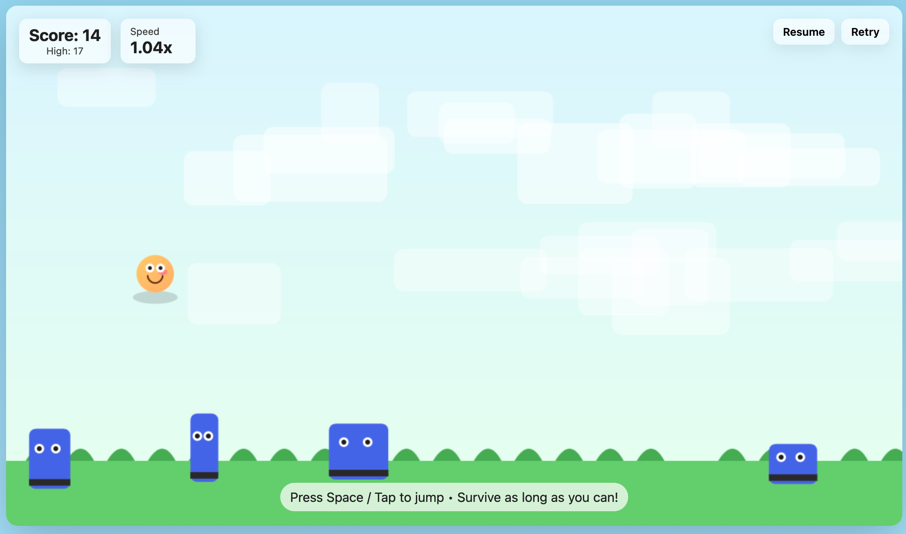
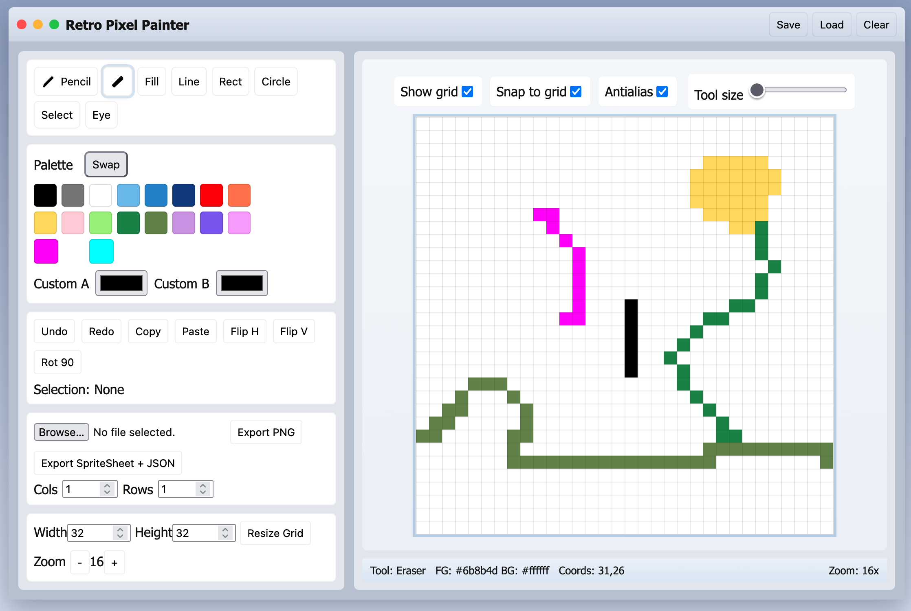

**Prompt** | **Result**
-----------|------------
**Rolling ball minigame** Create a single-page app in a single HTML file with the following requirements: - Name: Jumping Ball Runner - Goal: Jump over obstacles to survive as long as possible. - Features: Increasing speed, high score tracking, retry button, and funny sounds for actions and events. - The UI should be colorful, with parallax scrolling backgrounds. - The characters should look cartoonish and be fun to watch. - The game should be enjoyable for everyone. | 
**Pixel art** Create a single-page app, in a single HTML file, that provides a retro pixel painting experience. - Canvas: fixed pixel grid with zoom; tools for pencil, eraser, fill, line, rectangle, circle; grid toggle. - Palette: 16-color swatches with two custom slots; eyedropper; foreground/background swap. - Editing: undo/redo, copy/paste selection, flip/rotate selection, clear canvas; status bar with cursor coords. - UI shell: faux OS window (’90s style) with draggable title bar, toolbar icons, tooltip hints. - Import/Export: import PNG (quantize to palette) and export PNG/SpriteSheet + JSON; save/load from localStorage. - Shortcuts: number keys for tools, +/- for zoom; accessible labels and focus order. - Responsive layout; no uploads to servers. | 
